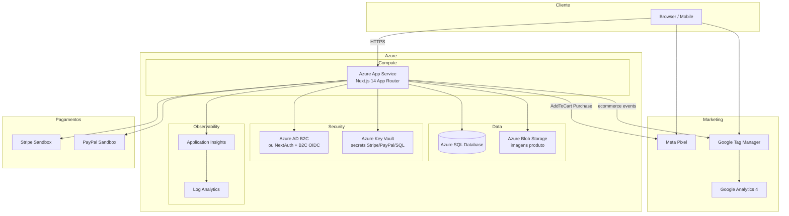
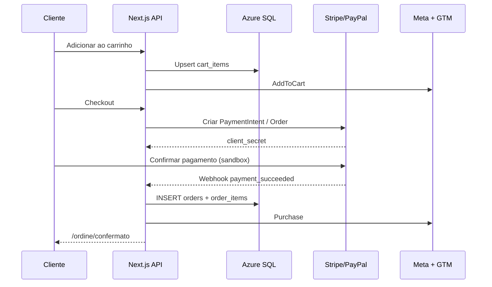

# Fase 2 — Loja Virtual Burger King Italia (Azure)

## Escolha do banco: Azure SQL Database

| Critério | Azure SQL | Cosmos DB |
|----------|-----------|-----------|
| Pedidos + itens + pagamentos | Relacional nativo (FK, transações ACID) | Modelagem manual, consistência eventual |
| Relatórios de vendas / GA4 | JOINs simples | Agregações mais complexas |
| Admin CRUD | Tabelas normais | Containers + partition keys |
| Custo inicial (loja média) | Previsível, tier Basic/S0 | Pode escalar caro com RU/s |

**Decisão:** **Azure SQL Database** para catálogo, carrinho persistido, pedidos, pagamentos e auditoria.

---

## Diagrama de arquitetura



---

## Fluxo de compra



---

## Estrutura do projeto

```
burgerking-qualita-clone/
├── docs/FASE2-ARQUITETURA-AZURE.md    ← este arquivo
├── database/
│   ├── schema.sql                     ← DDL Azure SQL
│   └── seed-products.mjs              ← seed 166 produtos BK
├── infra/azure/
│   ├── main.bicep                     ← App Service + SQL + Blob + Insights
│   └── parameters.example.json
└── shop/                              ← Next.js (frontend + API)
    ├── src/app/                       ← App Router (páginas + route handlers)
    ├── src/components/                ← UI fiel ao burgerking.it
    ├── src/lib/                       ← DB, auth, pagamentos, tracking
    └── .env.example
```

---

## Variáveis de ambiente (App Service)

| Variável | Uso |
|----------|-----|
| `DATABASE_URL` | Connection string Azure SQL |
| `AZURE_STORAGE_CONNECTION_STRING` | Blob imagens |
| `NEXTAUTH_SECRET` / `AZURE_AD_B2C_*` | Autenticação |
| `STRIPE_SECRET_KEY` / `STRIPE_WEBHOOK_SECRET` | Pagamento cartão |
| `PAYPAL_CLIENT_ID` / `PAYPAL_CLIENT_SECRET` | PayPal sandbox |
| `NEXT_PUBLIC_META_PIXEL_ID` | Facebook Ads |
| `NEXT_PUBLIC_GTM_ID` | Google Tag Manager |
| `APPLICATIONINSIGHTS_CONNECTION_STRING` | Monitoramento |

---

## Deploy rápido

```bash
# 1. Banco
sqlcmd -S bk-shop-sql.database.windows.net -d bk_shop -U admin -i database/schema.sql
node database/seed-products.mjs

# 2. Infra (opcional)
az deployment group create -g bk-shop-rg -f infra/azure/main.bicep -p infra/azure/parameters.example.json

# 3. App
cd shop && npm install && npm run build
# Publicar zip ou GitHub Actions → App Service
```

---

## Rotas principais

| Rota | Descrição |
|------|-----------|
| `/` | Home (design BK) |
| `/prodotti` | Catálogo |
| `/prodotti/[slug]` | Detalhe produto |
| `/carrello` | Carrinho |
| `/checkout` | Pagamento Stripe + PayPal |
| `/ordine/confermato` | Confirmação + evento Purchase |
| `/admin` | Dashboard |
| `/admin/prodotti` | CRUD produtos |
| `/api/products` | API pública catálogo |
| `/api/admin/products` | API admin (auth) |
| `/api/checkout/stripe` | PaymentIntent |
| `/api/webhooks/stripe` | Confirma pedido |